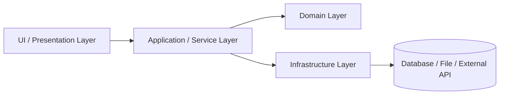
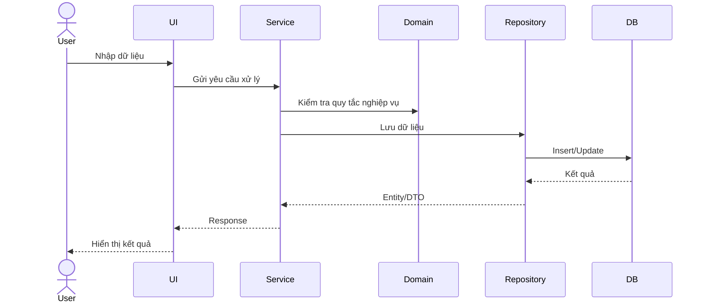
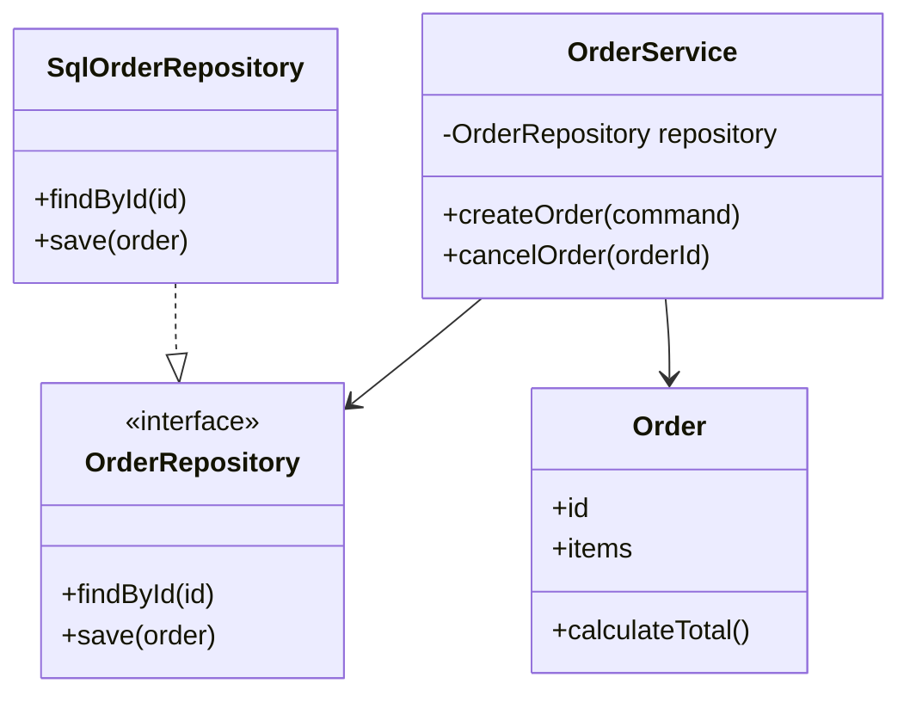
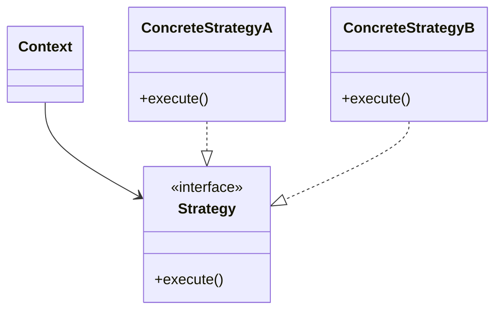

# Dàn ý báo cáo bài tập lớn môn Phát triển ứng dụng

**Học phần:** AC3030 – Phát triển ứng dụng  
**Tên đề tài:** `<Tên ứng dụng>`  
**Nhóm:** `<Mã nhóm>`  
**Học kỳ:** `<Học kỳ/Năm học>`  
**Ngày nộp:** `<dd/mm/yyyy>`  

---

## 0. Mục tiêu của báo cáo

Báo cáo cần giúp giảng viên trả lời nhanh các câu hỏi sau:

1. Ứng dụng có giải quyết đúng vấn đề đã chọn không?
2. Ứng dụng có chạy được trên máy giảng viên bằng file deploy/cài đặt không?
3. Kiến trúc, module, lớp có được thiết kế có chủ đích không?
4. Design pattern được dùng ở đâu, vì sao cần dùng?
5. SOLID được thể hiện cụ thể trong cấu trúc lớp/module nào?
6. Kiểm thử có tập trung vào domain/service layer không?
7. Nhóm có đủ bằng chứng: mã nguồn, kết quả chạy test, coverage, ảnh demo, dữ liệu demo, README?

> Lưu ý: Báo cáo không chỉ trình bày lý thuyết. Mỗi nhận xét về kiến trúc, pattern, SOLID, test phải gắn với **tên file, tên lớp, tên module, đường dẫn mã nguồn hoặc hình minh chứng cụ thể**.

---

## 1. Thông tin chung của đề tài

### 1.1. Tên đề tài

- Tên tiếng Việt:
- Tên tiếng Anh, nếu có:
- Loại ứng dụng: desktop/web/mobile/API/game/khác:
- Công nghệ sử dụng:
  - Ngôn ngữ lập trình:
  - Framework/thư viện chính:
  - Cơ sở dữ liệu:
  - Công cụ test:
  - Công cụ build/deploy:

### 1.2. Thông tin nhóm

| STT | Họ và tên | MSSV | Vai trò chính | Module phụ trách | Unit test phụ trách | Ghi chú |
|---:|---|---|---|---|---|---|
| 1 |  |  |  |  |  |  |
| 2 |  |  |  |  |  |  |
| 3 |  |  |  |  |  |  |
| 4 |  |  |  |  |  |  |

### 1.3. Link và file nộp kèm

| Loại minh chứng | Tên file/link | Ghi chú |
|---|---|---|
| Báo cáo chính | `Report_NhomXX.pdf/docx` | Bản chính để chấm |
| Slide bảo vệ | `Slide_NhomXX.pptx/pdf` | Tập trung vào vấn đề, giải pháp, kiến trúc, demo, test |
| Mã nguồn | `SourceCode_NhomXX.zip` | Không nộp thư mục build rác, không nộp secret |
| File deploy/cài đặt | `Deploy_NhomXX.zip` / `.exe` / `.apk` / `.jar` / `docker-compose.yml` | Phải chạy được trên máy giảng viên |
| README | `README.md` | Hướng dẫn cài đặt, chạy app, chạy test |
| Dữ liệu demo | `demo-data/`, `seed.sql`, `sample.json`, tài khoản demo | Đủ dữ liệu để demo ngay |

---

## 2. Tóm tắt vấn đề và giải pháp

### 2.1. Bối cảnh bài toán

Mô tả ngắn gọn:

- Người dùng mục tiêu là ai?
- Vấn đề thực tế cần giải quyết là gì?
- Vì sao vấn đề này cần một ứng dụng phần mềm?
- Hiện trạng hoặc cách làm thủ công đang có hạn chế gì?

### 2.2. Mục tiêu của ứng dụng

Liệt kê 3–5 mục tiêu chính:

1. 
2. 
3. 

### 2.3. Phạm vi chức năng

#### Chức năng có triển khai

| STT | Chức năng | Người dùng liên quan | Trạng thái | Minh chứng demo |
|---:|---|---|---|---|
| 1 |  |  | Hoàn thành/Chưa hoàn thành |  |
| 2 |  |  | Hoàn thành/Chưa hoàn thành |  |

#### Chức năng không nằm trong phạm vi

| STT | Chức năng chưa làm | Lý do |
|---:|---|---|
| 1 |  |  |

---

## 3. Yêu cầu bắt buộc về demo và deploy

### 3.1. Ứng dụng phải chạy được trên máy giảng viên

Nhóm cần chuẩn bị một cách chạy ổn định, ưu tiên theo thứ tự sau:

1. File cài đặt hoặc file chạy trực tiếp.
2. Gói deploy kèm script chạy.
3. Docker/Docker Compose, nếu ứng dụng phù hợp.
4. Hướng dẫn build từ source chỉ dùng khi không thể đóng gói deploy.

### 3.2. File deploy/cài đặt cần có

Tùy loại ứng dụng, nhóm chọn hình thức phù hợp:

| Loại ứng dụng | File deploy gợi ý |
|---|---|
| Desktop | `.exe`, `.msi`, `.jar`, thư mục portable, script chạy |
| Web frontend | bản build tĩnh, hướng dẫn serve, hoặc Docker |
| Web backend/API | file chạy, Docker Compose, hướng dẫn cấu hình `.env` |
| Mobile | `.apk` hoặc hướng dẫn cài trên emulator/thiết bị |
| Game | file build chạy được hoặc project build sẵn |

### 3.3. Dữ liệu demo bắt buộc

Báo cáo cần nêu rõ:

- Tài khoản demo, nếu có:
  - Username:
  - Password:
  - Vai trò:
- Dữ liệu mẫu:
  - File seed:
  - Cách import:
  - Số lượng bản ghi/chủ thể mẫu:
- Kịch bản demo nhanh trong 3–5 phút:
  1. 
  2. 
  3. 

### 3.4. Các lỗi thường gặp cần tránh

- Chỉ chạy được trên máy của nhóm do hard-code đường dẫn tuyệt đối.
- Thiếu database hoặc thiếu dữ liệu demo.
- Thiếu file `.env.example`.
- Cần tài khoản cloud/API key nhưng không cung cấp cách cấu hình.
- README không đủ chi tiết để giảng viên chạy lại.
- Nộp source nhưng không nộp file deploy/cài đặt.

---

## 4. Menu và màn hình bắt buộc trong chương trình

Ứng dụng cần có menu hoặc khu vực điều hướng với tối thiểu:

1. **Quit/Exit** – thoát chương trình hoặc đăng xuất/đóng ứng dụng.
2. **Info/About** – giới thiệu thông tin môn học, học kỳ, nhóm, thành viên.

### 4.1. Nội dung màn hình Info/About

Màn hình **Info/About** cần có:

- Tên môn học: `AC3030 – Phát triển ứng dụng`
- Học kỳ:
- Tên đề tài:
- Tên nhóm:
- Danh sách thành viên:
  - Họ tên
  - MSSV
  - Vai trò
  - Hình thành viên, nếu yêu cầu
- Phiên bản ứng dụng:
- Ngày build/release:

### 4.2. Minh chứng trong báo cáo

Chèn ảnh chụp màn hình:

- Menu chính có mục Quit/Exit.
- Menu hoặc màn hình Info/About.
- Màn hình có danh sách thành viên.

---

## 5. Phân tích yêu cầu và thiết kế chức năng

### 5.1. Tác nhân/người dùng

| STT | Tác nhân | Mô tả | Quyền/chức năng chính |
|---:|---|---|---|
| 1 |  |  |  |

### 5.2. Use case hoặc user story chính

| ID | Use case/User story | Tác nhân | Mức ưu tiên | Trạng thái |
|---|---|---|---|---|
| UC01 |  |  | Cao/Trung bình/Thấp |  |
| UC02 |  |  | Cao/Trung bình/Thấp |  |

### 5.3. Luồng nghiệp vụ chính

Mô tả 1–3 luồng quan trọng nhất. Mỗi luồng nên có:

- Điều kiện bắt đầu.
- Các bước xử lý chính.
- Kết quả đầu ra.
- Trường hợp lỗi hoặc ngoại lệ.

Ví dụ cấu trúc:

#### Luồng 1: `<Tên luồng>`

1. Người dùng ...
2. Hệ thống ...
3. Hệ thống kiểm tra ...
4. Hệ thống lưu/cập nhật ...
5. Hệ thống hiển thị kết quả ...

#### Ngoại lệ

| Mã lỗi | Tình huống | Cách xử lý |
|---|---|---|
| E01 |  |  |

---

## 6. Kiến trúc ứng dụng

### 6.1. Kiến trúc tổng thể

Nêu kiến trúc mà nhóm chọn, ví dụ:

- Layered Architecture
- MVC/MVP/MVVM
- Clean Architecture
- Client–Server
- REST API + Frontend
- Monolithic application
- Modular architecture

Cần giải thích:

1. Vì sao kiến trúc này phù hợp với bài toán?
2. Các layer/module chính là gì?
3. Mỗi layer/module chịu trách nhiệm gì?
4. Dữ liệu đi qua các layer như thế nào?
5. Kiến trúc này giúp kiểm thử, bảo trì, mở rộng ra sao?

### 6.2. Sơ đồ kiến trúc

Có thể dùng hình vẽ hoặc Mermaid.



### 6.3. Mô tả trách nhiệm từng layer/module

| Layer/Module | Trách nhiệm | Không nên làm | Ví dụ file/lớp |
|---|---|---|---|
| UI/Presentation | Hiển thị, nhận input | Không xử lý nghiệp vụ phức tạp |  |
| Application/Service | Điều phối use case | Không phụ thuộc trực tiếp vào UI cụ thể |  |
| Domain | Quy tắc nghiệp vụ cốt lõi | Không gọi database/UI trực tiếp |  |
| Infrastructure | Lưu trữ, API, file, framework | Không chứa rule nghiệp vụ chính |  |

### 6.4. Luồng xử lý tiêu biểu

Chọn 1–2 chức năng quan trọng và mô tả luồng xử lý từ UI đến database.

Ví dụ:



---

## 7. Thiết kế lớp/module và minh chứng SOLID

### 7.1. Biểu đồ lớp trích đoạn

Báo cáo cần có ít nhất một biểu đồ lớp trích đoạn tập trung vào phần quan trọng, không cần vẽ toàn bộ dự án.



### 7.2. Minh chứng SRP – Single Responsibility Principle

Giải thích ngắn:

- Mỗi lớp/module chỉ nên có một nhóm trách nhiệm chính.
- Khi có thay đổi, chỉ một lý do chính khiến lớp/module đó phải thay đổi.

Bảng minh chứng:

| Lớp/Module | Trách nhiệm chính | Trách nhiệm đã tách ra lớp/module khác | Vì sao thể hiện SRP? |
|---|---|---|---|
|  |  |  |  |

Gợi ý minh chứng:

- Controller chỉ nhận request/response, không xử lý nghiệp vụ chính.
- Service xử lý use case, không trực tiếp viết SQL nếu đã có Repository.
- Validator chỉ kiểm tra dữ liệu.
- Mapper chỉ chuyển đổi DTO/entity/view model.

### 7.3. Minh chứng OCP – Open/Closed Principle

Giải thích ngắn:

- Có thể mở rộng hành vi bằng cách thêm lớp/module mới.
- Hạn chế sửa mã nguồn cũ đã ổn định.

Bảng minh chứng:

| Điểm mở rộng | Interface/abstract class liên quan | Cách thêm chức năng mới | File/lớp minh chứng |
|---|---|---|---|
|  |  |  |  |

Ví dụ cách trình bày:

> Khi cần thêm hình thức tính phí mới, nhóm chỉ cần tạo lớp mới implement `FeeStrategy`, không sửa logic chính trong `CheckoutService`. Điều này giúp module checkout mở cho mở rộng nhưng đóng với sửa đổi trực tiếp.

### 7.4. Minh chứng DIP – Dependency Inversion Principle

Giải thích ngắn:

- Module cấp cao không phụ thuộc trực tiếp vào module cấp thấp.
- Cả hai nên phụ thuộc vào abstraction/interface.

Bảng minh chứng:

| Module cấp cao | Abstraction phụ thuộc | Module triển khai cụ thể | Cách inject/khởi tạo | Lợi ích |
|---|---|---|---|---|
|  |  |  |  |  |

Gợi ý minh chứng:

- `UserService` phụ thuộc `IUserRepository`, không phụ thuộc trực tiếp `MySqlUserRepository`.
- Khi test, có thể thay repository thật bằng fake/mock repository.
- Khi đổi database, service ít phải thay đổi.

### 7.5. Các nguyên tắc SOLID khác, nếu có

| Nguyên tắc | Minh chứng trong dự án | File/lớp liên quan |
|---|---|---|
| LSP |  |  |
| ISP |  |  |

---

## 8. Design pattern

Yêu cầu tối thiểu: **ít nhất 2 design pattern** được áp dụng và giải thích đúng lý do sử dụng.

### 8.1. Tổng hợp pattern đã dùng

| STT | Pattern | Nhóm pattern | Vị trí trong dự án | Vấn đề cần giải quyết | Lý do chọn |
|---:|---|---|---|---|---|
| 1 |  | Creational/Structural/Behavioral/Architectural |  |  |  |
| 2 |  | Creational/Structural/Behavioral/Architectural |  |  |  |

### 8.2. Pattern 1: `<Tên pattern>`

#### Vấn đề trước khi dùng pattern

Mô tả vấn đề thiết kế:

- Code bị lặp ở đâu?
- Module nào phụ thuộc chặt vào module nào?
- Có nhiều nhánh `if/else` hoặc `switch/case` khó mở rộng không?
- Có nhiều cách xử lý cùng một loại nghiệp vụ không?

#### Cách áp dụng trong dự án

- File/lớp/interface liên quan:
  - 
- Mô tả vai trò các lớp:
  - Context:
  - Strategy/Product/Factory/Observer/Adapter/etc.:
  - Concrete class:
- Luồng hoạt động:

#### Sơ đồ minh họa



#### Lợi ích đạt được

- 
- 
- 

#### Giới hạn hoặc đánh đổi

- 
- 

### 8.3. Pattern 2: `<Tên pattern>`

Trình bày tương tự Pattern 1.

### 8.4. Các pattern có thể cân nhắc

Nhóm chỉ chọn pattern thực sự có trong mã nguồn.

| Pattern | Khi nào phù hợp |
|---|---|
| Factory Method / Abstract Factory | Cần tạo nhiều loại object cùng họ, che giấu logic khởi tạo |
| Builder | Object có nhiều tham số cấu hình, cần tạo từng bước |
| Singleton | Chỉ dùng thận trọng cho cấu hình/logging/service dùng chung |
| Strategy | Có nhiều thuật toán/chính sách có thể hoán đổi |
| Observer / Pub-Sub | Một thay đổi cần thông báo cho nhiều thành phần |
| Adapter | Cần bọc thư viện/API bên ngoài để phù hợp interface nội bộ |
| Facade | Cần cung cấp interface đơn giản cho một hệ thống con phức tạp |
| Repository | Tách logic truy cập dữ liệu khỏi domain/service |
| MVC/MVVM | Tách UI, trạng thái, xử lý và dữ liệu |

---

## 9. Kiểm thử

### 9.1. Mục tiêu kiểm thử

Báo cáo cần nêu rõ:

- Kiểm thử nhằm xác nhận chức năng nào?
- Kiểm thử tập trung vào layer nào?
- Vì sao phần lớn test nên nằm ở domain/service layer?
- Những phần nào chưa kiểm thử được và lý do?

### 9.2. Công cụ kiểm thử

| Loại kiểm thử | Công cụ | Lệnh chạy | Ghi chú |
|---|---|---|---|
| Unit test |  |  |  |
| Integration test |  |  | Bonus, nếu có |
| Coverage |  |  |  |
| UI/E2E test | Playwright hoặc công cụ khác |  | Bonus |

### 9.3. Danh sách test case

Yêu cầu:

- Có **10–25 test case**.
- Mỗi thành viên phụ trách ít nhất một nhóm test/unit test.
- Mỗi thành viên có tối thiểu 05 test case hoặc theo phân công cụ thể của nhóm.
- Phần lớn test nằm ở **domain/service layer**.
- Không chỉ test giao diện.

| TC ID | Tên test case | Layer | Hàm/lớp được test | Dữ liệu vào | Kết quả mong đợi | Người phụ trách | Trạng thái |
|---|---|---|---|---|---|---|---|
| TC01 |  | Domain/Service |  |  |  |  | Pass/Fail |
| TC02 |  | Domain/Service |  |  |  |  | Pass/Fail |

### 9.4. Cấu trúc thư mục test

Ví dụ:

```text
tests/
  domain/
    order.test.*
    user.test.*
  services/
    checkout-service.test.*
  integration/
    api-order.test.*
  e2e/
    main-flow.spec.*
```

### 9.5. Minh chứng kết quả chạy test

Chèn vào báo cáo:

- Ảnh chụp terminal/IDE khi chạy test.
- Tổng số test: `<số lượng>`.
- Số test pass/fail.
- Lệnh chạy test.
- Thời điểm chạy test.
- Link hoặc đường dẫn file test.

Ví dụ:

```bash
npm test
npm run test:coverage
```

hoặc

```bash
pytest
pytest --cov
```

hoặc

```bash
dotnet test
```

### 9.6. Coverage

Báo cáo cần nêu:

| Chỉ số | Kết quả |
|---|---:|
| Statement coverage |  |
| Branch coverage |  |
| Function/method coverage |  |
| Line coverage |  |

Chèn ảnh hoặc bảng kết quả coverage.

### 9.7. Kiểm thử tích hợp/E2E bằng Playwright, bonus

Nếu có Playwright, trình bày:

- Kịch bản E2E chính.
- Cách chạy.
- Trình duyệt/môi trường test.
- Ảnh/video kết quả, nếu có.

Ví dụ cấu trúc:

| E2E ID | Kịch bản | Các bước chính | Kết quả mong đợi | Trạng thái |
|---|---|---|---|---|
| E2E01 | Đăng nhập và thực hiện chức năng chính |  |  | Pass/Fail |

---

## 10. Refactoring và chất lượng mã nguồn

### 10.1. Code smell đã phát hiện

| STT | Code smell | Vị trí | Ảnh hưởng | Cách xử lý |
|---:|---|---|---|---|
| 1 | Long Method / Large Class / Duplicated Code / Feature Envy / khác |  |  |  |

### 10.2. Refactoring đã thực hiện

| STT | Trước refactoring | Sau refactoring | Kỹ thuật áp dụng | Minh chứng |
|---:|---|---|---|---|
| 1 |  |  | Extract Method / Extract Class / Introduce Interface / khác |  |

### 10.3. Tác động của refactoring

- Code dễ đọc hơn ở điểm nào?
- Test có giúp đảm bảo refactoring không làm sai chức năng không?
- Module nào dễ mở rộng hơn sau khi refactor?

---

## 11. Hướng dẫn cài đặt, chạy dự án và chạy test

Phần này có thể trùng với README nhưng trong báo cáo vẫn cần tóm tắt.

### 11.1. Yêu cầu môi trường

| Thành phần | Phiên bản yêu cầu | Ghi chú |
|---|---|---|
| OS | Windows/Linux/macOS |  |
| Runtime/SDK |  |  |
| Database |  |  |
| Công cụ khác |  |  |

### 11.2. Cài đặt từ file deploy

Các bước:

1. Tải/mở thư mục deploy.
2. Chạy file cài đặt hoặc script:
   ```bash
   <lệnh cài đặt/chạy>
   ```
3. Import dữ liệu demo, nếu cần:
   ```bash
   <lệnh import seed>
   ```
4. Mở ứng dụng tại:
   - Desktop:
   - Web URL:
   - Mobile:
5. Đăng nhập bằng tài khoản demo:
   - Username:
   - Password:

### 11.3. Chạy từ source code

```bash
# 1. Cài dependency
<lệnh>

# 2. Tạo file cấu hình
cp .env.example .env

# 3. Khởi tạo database/dữ liệu demo
<lệnh>

# 4. Chạy ứng dụng
<lệnh>

# 5. Chạy test
<lệnh>

# 6. Chạy coverage
<lệnh>
```

### 11.4. Các lỗi thường gặp khi chạy

| Lỗi | Nguyên nhân có thể | Cách xử lý |
|---|---|---|
|  |  |  |

---

## 12. Kết quả demo

### 12.1. Danh sách màn hình/chức năng đã demo

| STT | Màn hình/chức năng | Ảnh minh chứng | Ghi chú |
|---:|---|---|---|
| 1 |  |  |  |

### 12.2. Kịch bản demo đề xuất khi bảo vệ

Thời lượng gợi ý: 5–7 phút.

1. Giới thiệu bài toán và người dùng.
2. Mở ứng dụng từ file deploy.
3. Mở màn hình Info/About.
4. Demo 2–3 chức năng chính.
5. Hiển thị dữ liệu demo.
6. Chạy test hoặc hiển thị kết quả test/coverage.
7. Kết luận điểm mạnh, hạn chế và hướng phát triển.

---

## 13. Phân công công việc và đóng góp của thành viên

### 13.1. Phân công theo module

| Thành viên | Module/chức năng | File/lớp chính | Test case phụ trách | Mức độ hoàn thành |
|---|---|---|---|---|
|  |  |  |  |  |

### 13.2. Minh chứng làm việc nhóm

Có thể đưa vào phụ lục:

- Lịch họp nhóm.
- Commit log.
- Trello/Jira/GitHub Issues.
- Bảng phân công.
- Biên bản review code/test.

---

## 14. Hạn chế và hướng phát triển

### 14.1. Hạn chế hiện tại

| STT | Hạn chế | Nguyên nhân | Ảnh hưởng |
|---:|---|---|---|
| 1 |  |  |  |

### 14.2. Hướng phát triển

| STT | Hướng phát triển | Lợi ích | Mức ưu tiên |
|---:|---|---|---|
| 1 |  |  | Cao/Trung bình/Thấp |

---

## 15. Kết luận

Tóm tắt ngắn gọn:

- Ứng dụng đã giải quyết được vấn đề gì?
- Nhóm đã học được gì về phát triển ứng dụng?
- Kiến trúc/pattern/SOLID/test đã giúp dự án tốt hơn như thế nào?
- Những điểm nhóm tự đánh giá là nổi bật nhất.

---

# Phụ lục A. Cấu trúc gói nộp đề xuất

Nên nộp theo cấu trúc sau:

```text
NhomXX_TenDeTai/
  01_Report/
    Report_NhomXX.docx
    Report_NhomXX.pdf

  02_Slide/
    Slide_NhomXX.pptx
    Slide_NhomXX.pdf

  03_SourceCode/
    SourceCode_NhomXX.zip

  04_Deploy/
    app-installer.exe
    app-release.apk
    app.jar
    docker-compose.yml
    demo-data/
    seed.sql
    .env.example

  05_TestEvidence/
    test-result.png
    coverage-report.png
    coverage/
    playwright-report/

  README.md
```

Không nên nộp:

- `node_modules/`
- `bin/`, `obj/`, `build/`, `dist/` nếu có thể build lại, trừ thư mục deploy đã chuẩn bị riêng
- `.git/`
- File chứa mật khẩu thật, token thật, API key thật
- Database quá lớn không cần thiết
- File tạm của IDE

---

# Phụ lục B. Mẫu README.md

```markdown
# <Tên ứng dụng>

## 1. Thông tin nhóm

- Môn học: AC3030 – Phát triển ứng dụng
- Học kỳ:
- Nhóm:
- Thành viên:

## 2. Mô tả ngắn

<Ứng dụng giải quyết vấn đề gì, người dùng là ai, chức năng chính là gì?>

## 3. Công nghệ sử dụng

- Language:
- Framework:
- Database:
- Test framework:
- Build/deploy:

## 4. Cách chạy bản deploy

### 4.1. Yêu cầu môi trường

- OS:
- Runtime:
- Database, nếu cần:

### 4.2. Các bước chạy

```bash
<lệnh hoặc hướng dẫn>
```

### 4.3. Tài khoản demo

- Username:
- Password:
- Role:

## 5. Cách chạy từ source

```bash
<lệnh cài dependency>
<lệnh chạy app>
```

## 6. Cách chạy test

```bash
<lệnh chạy unit test>
<lệnh chạy coverage>
```

## 7. Cấu trúc thư mục

```text
src/
tests/
docs/
deploy/
```

## 8. Ghi chú lỗi thường gặp

| Lỗi | Cách xử lý |
|---|---|
|  |  |
```

---

# Phụ lục C. Mẫu checklist tự kiểm tra trước khi nộp

| STT | Tiêu chí | Đã có? | Minh chứng/đường dẫn |
|---:|---|:---:|---|
| 1 | Ứng dụng chạy được trên máy khác bằng file deploy/cài đặt | ☐ |  |
| 2 | Có dữ liệu demo/tài khoản demo | ☐ |  |
| 3 | Có README hướng dẫn chạy deploy, source, test | ☐ |  |
| 4 | Có ít nhất 2 design pattern | ☐ |  |
| 5 | Mỗi pattern có lý do sử dụng và vị trí mã nguồn | ☐ |  |
| 6 | Có minh chứng SRP | ☐ |  |
| 7 | Có minh chứng OCP | ☐ |  |
| 8 | Có minh chứng DIP | ☐ |  |
| 9 | Có biểu đồ lớp trích đoạn | ☐ |  |
| 10 | Có 10–25 test case | ☐ |  |
| 11 | Mỗi thành viên có phần unit test/test case được phân công | ☐ |  |
| 12 | Phần lớn test nằm ở domain/service layer | ☐ |  |
| 13 | Có kết quả chạy test | ☐ |  |
| 14 | Có kết quả coverage | ☐ |  |
| 15 | Có menu Quit/Exit | ☐ |  |
| 16 | Có màn hình Info/About đủ thông tin môn học, kỳ, nhóm, thành viên | ☐ |  |
| 17 | Có slide/Word trình bày vấn đề, giải pháp, kiến trúc, demo, test | ☐ |  |
| 18 | Có kiểm thử tích hợp/E2E bằng Playwright, nếu làm bonus | ☐ |  |

---

# Phụ lục D. Dàn ý slide bảo vệ

Gợi ý 8–10 slide:

1. **Tên đề tài và nhóm**
   - Tên ứng dụng
   - Thành viên
   - Vai trò từng người

2. **Vấn đề**
   - Người dùng mục tiêu
   - Nhu cầu/vấn đề thực tế
   - Hạn chế của cách làm hiện tại

3. **Giải pháp**
   - Ý tưởng chính
   - Chức năng nổi bật
   - Phạm vi đã triển khai

4. **Demo nhanh**
   - Màn hình chính
   - Màn hình Info/About
   - 2–3 chức năng chính

5. **Kiến trúc**
   - Sơ đồ tổng thể
   - Các layer/module chính
   - Luồng xử lý chính

6. **Design pattern**
   - Pattern 1: dùng ở đâu, vì sao
   - Pattern 2: dùng ở đâu, vì sao

7. **SOLID và thiết kế lớp**
   - Biểu đồ lớp trích đoạn
   - Minh chứng SRP/OCP/DIP

8. **Kiểm thử**
   - Số lượng test case
   - Test ở layer nào
   - Kết quả chạy test
   - Coverage

9. **Deploy và hướng dẫn chạy**
   - File deploy/cài đặt
   - Dữ liệu demo
   - Cách giảng viên có thể chạy lại

10. **Kết luận**
    - Kết quả đạt được
    - Hạn chế
    - Hướng phát triển

---

# Phụ lục E. Gợi ý tiêu chí tự chấm nhanh

| Nhóm tiêu chí | Câu hỏi tự đánh giá |
|---|---|
| Chạy được | Người khác có thể chạy app mà không cần hỏi lại nhóm không? |
| Demo | Có đủ dữ liệu mẫu để demo chức năng chính không? |
| Kiến trúc | Nhóm có giải thích được vì sao chọn kiến trúc hiện tại không? |
| Pattern | Pattern có giải quyết vấn đề thiết kế thật hay chỉ nêu cho đủ? |
| SOLID | Có chỉ ra lớp/module cụ thể không? |
| Test | Test có kiểm tra nghiệp vụ lõi hay chỉ kiểm tra UI đơn giản? |
| Coverage | Có ảnh/log/báo cáo coverage không? |
| README | Có đủ lệnh chạy app, chạy test, chạy coverage không? |
| Slide | Slide có tập trung vào vấn đề, giải pháp, kiến trúc, demo, test không? |
